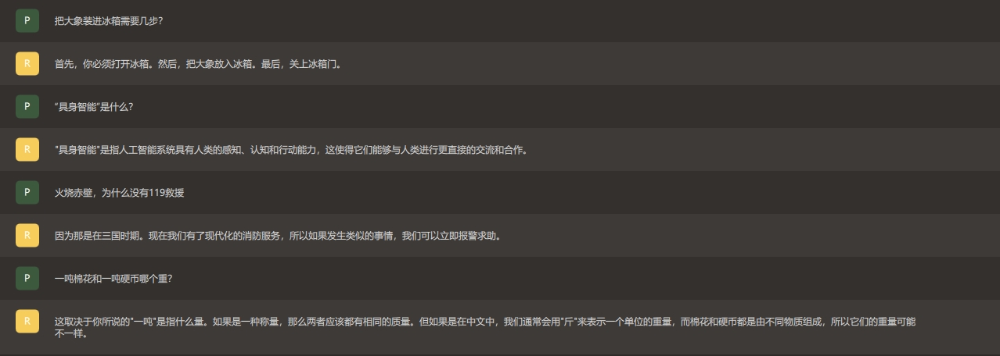

# Llama3_finetune_deployment
基于 Unsloth 开源微调框架，在开源数据集上利用 LoRA 方法对其进行微调，微调后模型的中文对话性能有所提升。此外，分别以界面和 API 的形式将其部署在本地主机，其中 API 方式的部署可以供其他计算机访问。



## 安装依赖
``` python
import torch
major_version, minor_version = torch.cuda.get_device_capability()
!pip install "unsloth[colab-new] @ git+https://github.com/unslothai/unsloth.git"
if major_version >= 8:
  !pip install --no-deps packaging ninja einops flash-attn xformers trl peft accelerate bitsandbytes
else:
  !pip install --no-deps xformers trl peft accelerate bitsandbytes
pass
```

## 模型微调
选用 Unsloth 开源微调框架，该开源框架对硬件要求特别低，训练速度特别快，与 Llama3 官方提供的训练框架相比，它的速度要快 2-5 倍。另一个原因是官方训练框架中训练功能还没有更新，而 Unsloth 提供了量化好的 4 位模型，包括 8B 参数和 70B 参数。
``` cmd
python finetune.py
```

## 模型测试
模型微调完成后，可以用 test.py 文件进行测试
``` cmd
python test.py
```

## 本地界面部署
- 下载并安装 GPT4ALL 应用程序
- 将微调后的模型放置到 C:/Users/***/AppData/Local/nomic.ai/GPT4ALL 文件夹下
- 运行 GPT4ALL 应用程序，选择模型后即可开始对话

## 本地 API 部署
``` cmd
python sever.py
```

## 客户端访问
``` cmd
python client.py
```
